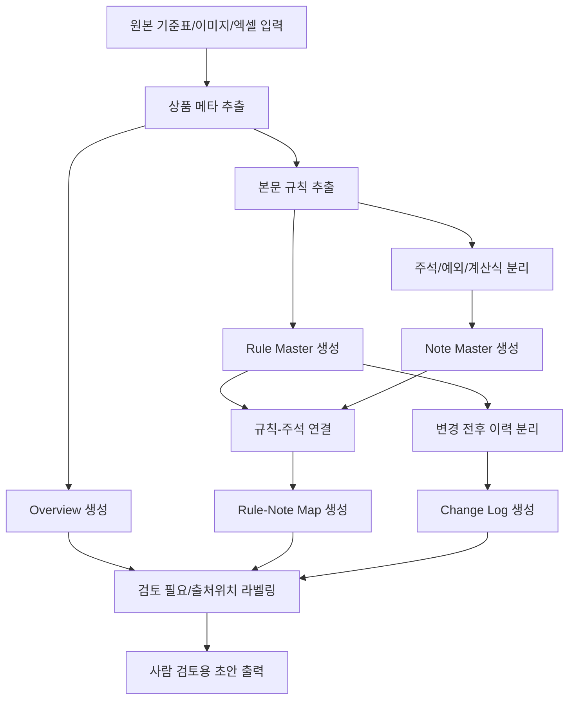

# architecture.md — 공통 코어 에이전트 입력 → 처리 → 출력

## Goal

원본 기준 자료를 후속 에이전트가 공통으로 사용할 수 있는 구조화 입력 템플릿으로 변환한다. 핵심은 해석 일관성, 출처 추적 가능성, 안전한 데이터 경계를 확보하는 것이다.

## Input

- 가이드라인 표 이미지
- 엑셀 시트
- 문서 발췌
- 주석, 예외, 계산식 포함 자료
- 변경 전후 이력 자료

## Process

1. 원본 자료 읽기
2. 상품명, 판매일자 등 기본 메타를 `Overview`에 구성
3. 본문 규칙 추출 및 `Rule Master` 구성
4. 주석, 예외, 계산식 분리 후 `Note Master` 구성
5. 규칙-주석 연결 후 `Rule-Note Map` 구성
6. 변경 전후 정보 분리 후 `Change Log` 구성
7. 불확실성, 충돌, 누락 가능성에 `검토 필요` 라벨 부여
8. 사람 검토 가능한 초안으로 출력

## Output

- `Overview`
- `Rule Master`
- `Note Master`
- `Rule-Note Map`
- `Change Log`
- 필요 시 Markdown/CSV/JSON 구조화 결과

## HITL

- 본문과 주석이 충돌할 때
- 변경 전후 구분이 불명확할 때
- OCR 결과가 불확실할 때
- 적용대상이나 예외 범위가 모호할 때

## Failure / Fallback

- 원천 데이터 누락: 누락 위치를 표시하고 담당자 확인 요청
- 주석 연결 불명확: 연결 후보 또는 `검토 필요`로 표시
- 표 구조 깨짐: 셀 병합/이미지 판독 이슈를 메모로 남김
- 변경 이력 불명확: 상태 전환 보류 후 확인 요청

## Data Boundary

- 개인정보, 계약번호, 주민번호는 제외 또는 마스킹
- 내부 기준 원문 전체 복사 금지
- 출처위치 중심으로 추적성 확보
- 모든 결과는 `초안`이며 업무 확정 데이터가 아님

## Execution Flow

